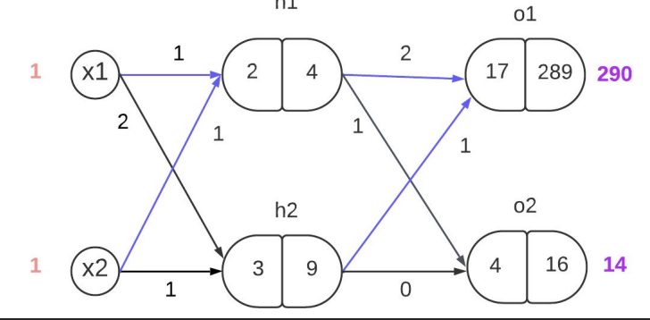

# Neural Network Implementations — From Scratch & Scikit-Learn 🧠

This repository explores the fundamentals of feed‑forward Neural Networks with two implementations:
- Manual (From Scratch): a math-first implementation tracing forward propagation, backpropagation, and parameter updates without high-level ML libraries.
- Scikit-Learn: a practical implementation using `MLPRegressor` for comparison and validation.

---

## Overview
The goal of this project is to de-mystify the "black box" of neural networks by manually tracing weights, biases, activations and gradients so you can see exactly how a network learns and updates parameters.

---

## The implemented Network


## Learning Goals (Manual Implementation)
- Derivatives & Gradients: calculate partial derivatives of the loss with respect to weights and biases (∂L/∂w, ∂L/∂b).
- Chain Rule: manually apply the chain rule to propagate gradients from the output back through hidden layers.
- Computational Graph: trace data forward and gradients backward to understand error flow.
- Weight Updates: implement gradient descent updates: w_new = w_old − α * gradient.

Key concepts covered:
- Forward propagation (layer-by-layer activations)
- Backpropagation (manual gradient computation and parameter updates)
- Activation functions (Sigmoid, tanh, ReLU)
- Optimization: manual batch Gradient Descent vs. scikit-learn solvers (SGD, Adam)

---

## Project Structure
Neural-Network-Implementations/
- Manual/
  - NeuralNetwork.py — network logic (layers, forward, backprop, training)
  - Neuron.py — per-neuron representation (weights, bias, activation helpers)
  - NeuronLayer.py — layer-level batched forward/backprop helpers
  - main.py — example script: data generation, training loop, evaluation, plots
- sklearn/
  - sklearn_imp.py — example using scikit-learn's MLPRegressor
  - data2_200x30.csv — small dataset 
- README.md — this file

---

## Prerequisites
Install Python 3 and the required packages:

```bash
python3 -m pip install --upgrade pip
python3 -m pip install numpy pandas scikit-learn matplotlib
```

---

## Running the Manual Implementation
Open Terminal (or VS Code integrated terminal):

```bash
cd "NN implementation/Manual"
python3 main.py
```

